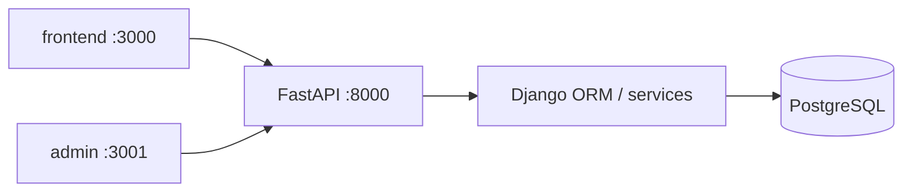

# Architecture

## Boundary

The platform is split into three independently owned applications:

- `frontend/` — Next.js Ranger PWA. Talks to the platform only through REST APIs.
- `admin/` — Next.js admin console. Same rule: REST only, no direct DB access.
- `backend/` — Django domain core and FastAPI REST surface.

UIs never import backend code and never connect directly to PostgreSQL.

On a single EC2, Nginx exposes:

- `/` → Ranger
- `/console` → Admin (`NEXT_PUBLIC_BASE_PATH=/console`)
- `/api/` → FastAPI

## Backend shape

Django owns:

- Database models and migrations
- Django Admin
- Authentication state
- RBAC (`ranger`, `admin`, `recruiter`)
- Wallet ledger
- Admin/recruiter business operations
- Audit logs

FastAPI owns:

- Public REST API routing
- OpenAPI docs
- Ranger, recruiter, admin, notification, maps, and future AI endpoints

FastAPI initializes Django and uses the Django ORM through service modules. API routers stay thin; business rules belong in `backend/apps/core/services/`.

## Frontend / admin shape

Both Next apps are feature-oriented and design-system constrained:

- `src/design-system` — Spoto tokens and reusable primitives
- `src/components` — app-shell and shared product components
- `src/app` — route-level composition
- `src/lib/api` — REST client

Do not define one-off visual styles in feature code when a design-system primitive exists.
