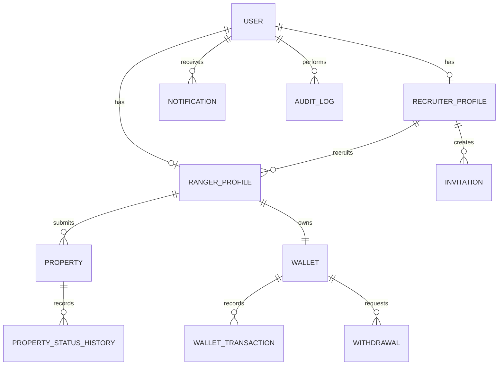

# Database

**Engine: PostgreSQL only.** SQLite is rejected at startup.

Core entities:

- `users`
- `ranger_profiles`
- `recruiter_profiles`
- `invitations`
- `otp_sessions`
- `properties`
- `property_status_history`
- `wallets`
- `wallet_transactions`
- `withdrawals`
- `notifications`
- `training_articles`
- `audit_logs`

Wallet balances must be derived from an append-only ledger pattern. Direct balance updates should happen only inside wallet service transactions.

