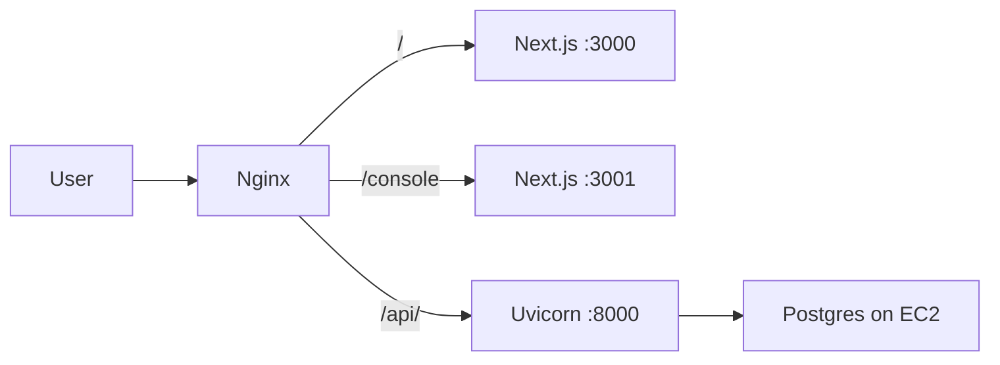

# Minimum-cost AWS deploy (single EC2)

Cheapest production setup: **one EC2** runs Nginx + Ranger + Admin + FastAPI + PostgreSQL.

No RDS, no Redis, no Docker, no ALB.

| Item | Choice | Why |
|------|--------|-----|
| Compute | `t3.micro` or free-tier `t2.micro` | ~$0–10/mo |
| Region | `ap-south-1` (Mumbai) | Lower latency in India |
| Database | Postgres **on the same EC2** | Avoids RDS (~$15+/mo) |
| Redis | **Not used** | Skip entirely |
| URL | Public IP first | No domain required |



---

## 1. AWS Console (~10 minutes)

1. **Region:** Asia Pacific (Mumbai) `ap-south-1`
2. **Key pair:** create/download `.pem` (you need this for SSH)
3. **Security group** inbound:
   - SSH `22` — your IP only
   - HTTP `80` — `0.0.0.0/0`
   - (Later) HTTPS `443` — `0.0.0.0/0`
   - Do **not** open `3000` / `3001` / `8000` / `5432` publicly
4. **Launch instance**
   - AMI: Ubuntu Server 22.04 or 24.04 LTS
   - Type: `t3.micro` (or `t2.micro` on free tier)
   - Storage: **20 GB gp3**
   - Attach the security group + key pair
5. Copy the instance **Public IPv4** (or allocate an Elastic IP and associate it)

### SSH

```bash
chmod 400 your-key.pem
ssh -i your-key.pem ubuntu@PUBLIC_IP
```

---

## 2. Put the code on the server

```bash
sudo mkdir -p /opt/spotoranger
sudo chown ubuntu:ubuntu /opt/spotoranger

# Option A — git
git clone YOUR_REPO_URL /opt/spotoranger

# Option B — from your laptop (run locally)
# scp -i your-key.pem -r spotoranger ubuntu@PUBLIC_IP:/opt/spotoranger
```

---

## 3. Configure `.env`

```bash
cd /opt/spotoranger
cp .env.example .env
nano .env
```

Set at least:

```env
ENVIRONMENT=production
DJANGO_DEBUG=false
DJANGO_SECRET_KEY=<long-random-secret>
POSTGRES_PASSWORD=<strong-password>
DATABASE_URL=postgresql://spoto:<strong-password>@127.0.0.1:5432/spoto_ranger

# Replace PUBLIC_IP with the EC2 public IP (or Elastic IP)
NEXT_PUBLIC_API_BASE_URL=http://PUBLIC_IP/api
DJANGO_ALLOWED_HOSTS=PUBLIC_IP,localhost,127.0.0.1
CORS_ALLOWED_ORIGINS=http://PUBLIC_IP,http://localhost:3000,http://localhost:3001

# SMS / DLT keys
SMS_API_KEY=...
DLT_SENDER_ID=...
DLT_TEMPLATE_ID=...
DLT_PE_ID=...
```

Redis is unused — leave `REDIS_URL` blank.

Bootstrap writes `admin/.env` automatically with `NEXT_PUBLIC_BASE_PATH=/console`.

---

## 4. One-command bootstrap

```bash
cd /opt/spotoranger
sudo bash deploy/bootstrap-ec2.sh
```

This installs Postgres, Node 22, Nginx, Python venv, runs migrations, builds **Ranger + Admin**, and enables systemd services.

When it finishes:

| URL | What |
|-----|------|
| `http://PUBLIC_IP` | Ranger website |
| `http://PUBLIC_IP/console` | Admin console |
| `http://PUBLIC_IP/api/docs` | FastAPI docs |
| `http://PUBLIC_IP/api/health` | Health check |

Create an admin user (Django shell or your preferred seed) before logging into `/console`.

---

## 5. Useful commands

```bash
sudo systemctl status spoto-ranger-api spoto-ranger-web spoto-ranger-admin nginx
sudo journalctl -u spoto-ranger-api -f
sudo journalctl -u spoto-ranger-web -f
sudo journalctl -u spoto-ranger-admin -f

# After changing API URL — rebuild both Next apps
cd /opt/spotoranger/frontend && npm run build && sudo systemctl restart spoto-ranger-web
cd /opt/spotoranger/admin && npm run build && sudo systemctl restart spoto-ranger-admin
```

---

## 6. Optional later (still cheap)

### Domain + HTTPS

1. Point domain A-record → Elastic IP  
2. Update `.env` hosts/CORS/`NEXT_PUBLIC_API_BASE_URL` to `https://yourdomain.com/api`  
3. Rebuild frontend + admin  
4. Switch Nginx to domain config or keep path `/api/` + `/console`  
5. `sudo apt install certbot python3-certbot-nginx && sudo certbot --nginx`

### Tiny Postgres backup cron

```bash
# daily dump to /var/backups
0 3 * * * sudo -u postgres pg_dump spoto_ranger | gzip > /var/backups/spoto_ranger_$(date +\%F).sql.gz
```

---

## Cost checklist (do this)

- [ ] One `t3.micro` / `t2.micro` only — no second instance  
- [ ] Postgres on EC2 — **not** RDS  
- [ ] No Redis / ElastiCache  
- [ ] No Application Load Balancer  
- [ ] Security group: only 22 + 80 (+ 443 later) — not 3001/8000/5432  
- [ ] Stop the instance when not testing (billing pauses compute; EBS still costs a little)

## Files in this repo

| Path | Purpose |
|------|---------|
| [`deploy/bootstrap-ec2.sh`](../deploy/bootstrap-ec2.sh) | Full server setup |
| [`deploy/nginx/spoto-ranger-ip.conf`](../deploy/nginx/spoto-ranger-ip.conf) | `/` + `/console` + `/api/` |
| [`deploy/nginx/spoto-ranger.conf`](../deploy/nginx/spoto-ranger.conf) | Optional domain setup |
| [`deploy/systemd/*.service`](../deploy/systemd/) | API + Ranger + Admin |
